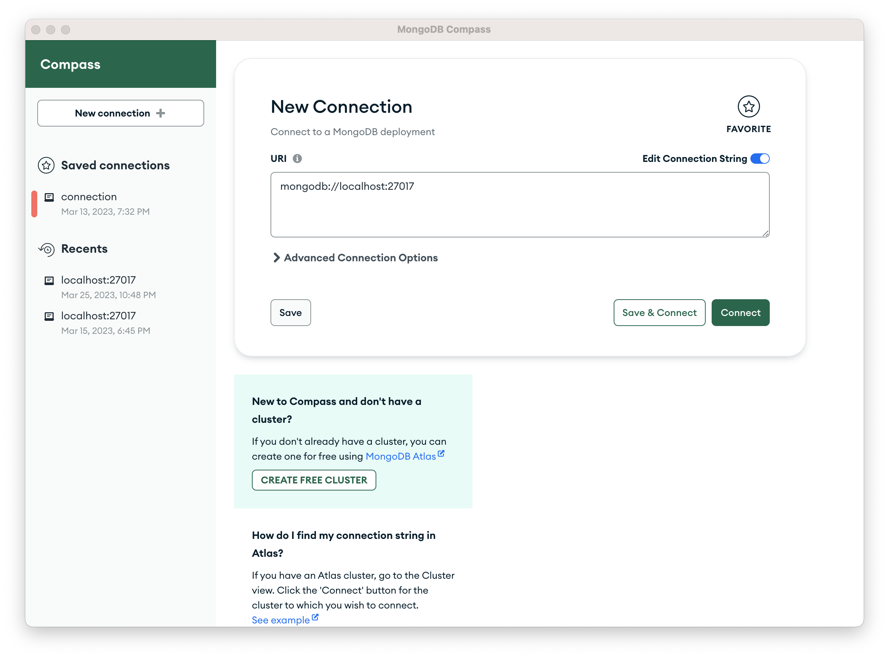
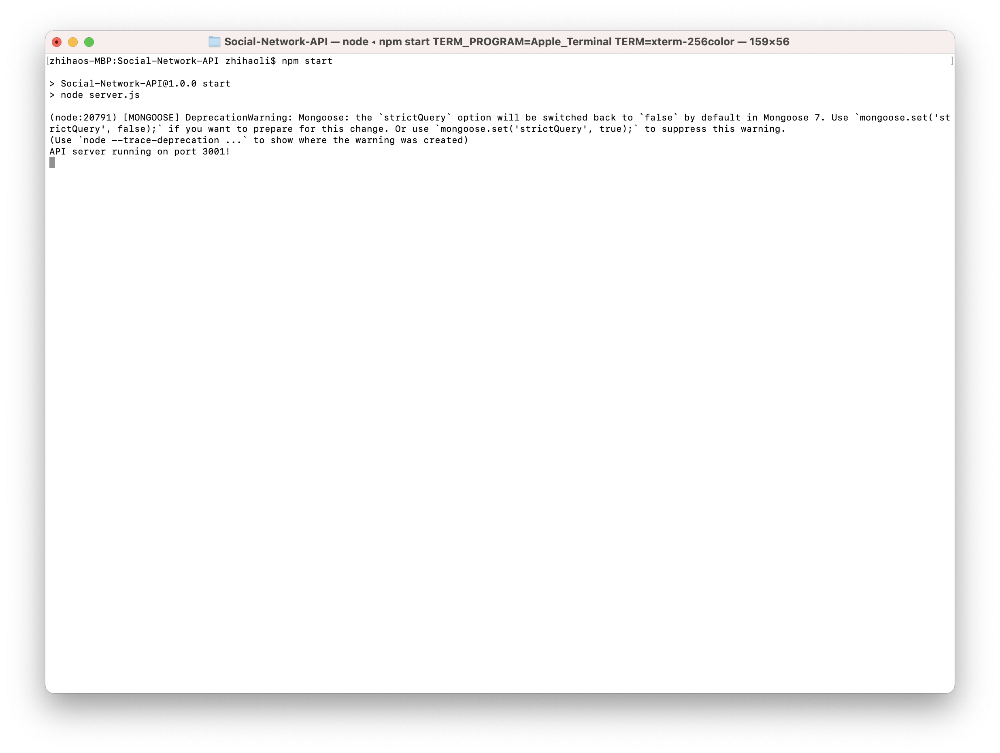
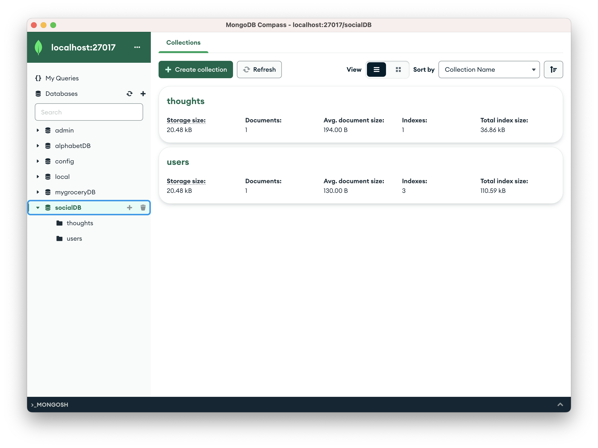
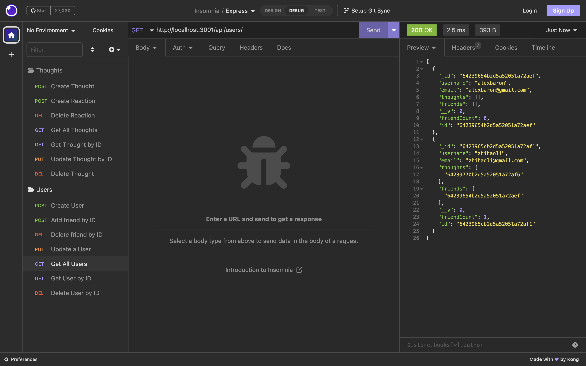
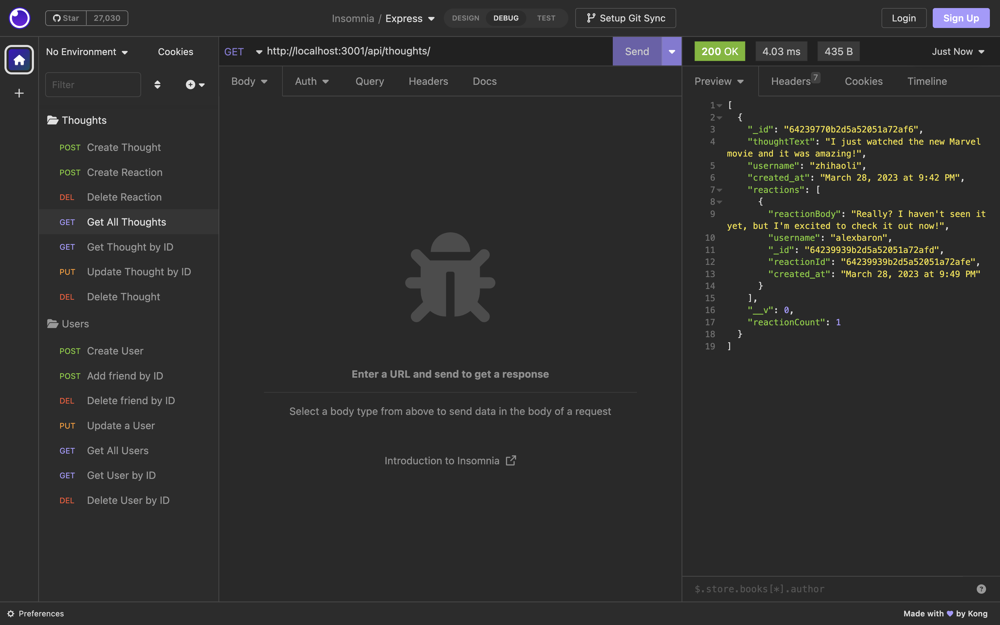

# Social-Network-API

## Description
This project is a backend API for a social network web application where users can share their thoughts, add other users as friends, and post reactions under other users' thoughts. This API application supports full CRUD (create, read, update, and delete) operations. The key tools for developing this API application are Express.js routing, MongoDB database, and the Mongoose ODM.

## Table of Contents
1. [Installation](#Installation)
2. [Usage](#Usage)
3. [Contributing](#Contributing)
4. [License](#License)
5. [Tests](#Tests)
6. [Questions](#Questions)
7. [Github](#Github)
8. [YouTube](#YouTube)
9. [Screenshots](#Screenshots)

## Installation 
1. Install package.json with command `npm i`

## Usage 
1. Run MongoDB Compass and connect to `mongodb://localhost:27017`
2. Open an external ternimal from the repository
3. Start the server with command: `npm start`
4. The schema will be automatically created in MongoDB Compass 

## Contributing 

### Mongoose
https://www.npmjs.com/package/mongoose

### MongoDB
https://www.mongodb.com/

### Express.js
https://expressjs.com/

### Nodemon
https://www.npmjs.com/package/nodemon

## License 
UNLICENSED

## Tests 
N/A

## Questions 

### Email
1. zli02@alumni.risd.edu
2. seanlee900214@gmail.com

## Github 

### Github profile
https://github.com/lzh1990214

### Github repository
https://github.com/lzh1990214/Social-Network-API

## YouTube demo video 
https://youtu.be/F_Xu9bnQcv4Links

## Screenshots 

### MongoDB Compass Connection

### Run local server

### Collections and documents in MongoDB Compass

### Route test - Get all users

### Route test - Get all thoughts

